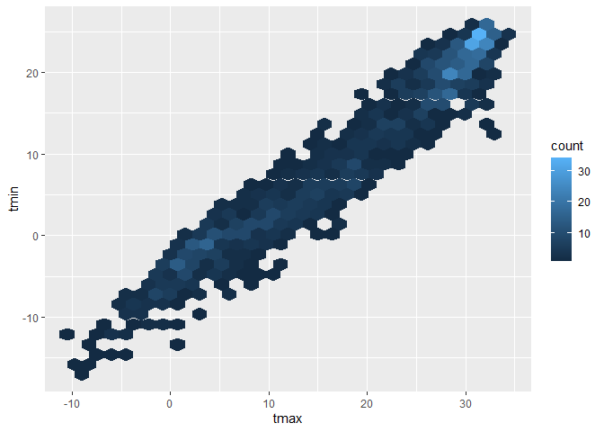
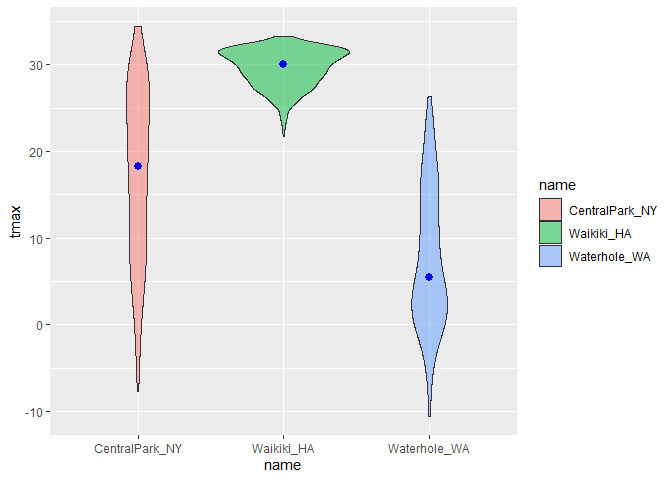
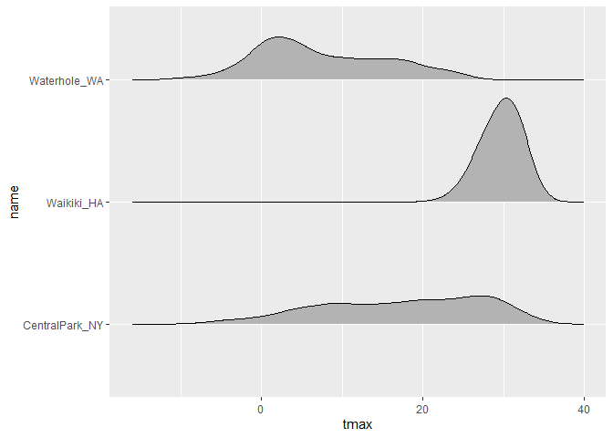

viz1
================
Yifei Zhao
2022-09-29

## R Markdown

``` r
weather_df = 
  rnoaa::meteo_pull_monitors(
    c("USW00094728", "USC00519397", "USS0023B17S"),
    var = c("PRCP", "TMIN", "TMAX"), 
    date_min = "2017-01-01",
    date_max = "2017-12-31") %>%
  mutate(
    name = recode(
      id, 
      USW00094728 = "CentralPark_NY", 
      USC00519397 = "Waikiki_HA",
      USS0023B17S = "Waterhole_WA"),
    tmin = tmin / 10,
    tmax = tmax / 10) %>%
  select(name, id, everything())
```

    ## Registered S3 method overwritten by 'hoardr':
    ##   method           from
    ##   print.cache_info httr

    ## using cached file: C:\Users\Administrator\AppData\Local/Cache/R/noaa_ghcnd/USW00094728.dly

    ## date created (size, mb): 2022-09-29 10:35:19 (8.418)

    ## file min/max dates: 1869-01-01 / 2022-09-30

    ## using cached file: C:\Users\Administrator\AppData\Local/Cache/R/noaa_ghcnd/USC00519397.dly

    ## date created (size, mb): 2022-09-29 10:35:35 (1.703)

    ## file min/max dates: 1965-01-01 / 2020-03-31

    ## using cached file: C:\Users\Administrator\AppData\Local/Cache/R/noaa_ghcnd/USS0023B17S.dly

    ## date created (size, mb): 2022-09-29 10:35:43 (0.952)

    ## file min/max dates: 1999-09-01 / 2022-09-30

let’s make a scatterplot

``` r
ggplot(weather_df, aes(x = tmin, y = tmax)) + 
  geom_point()
```

    ## Warning: Removed 15 rows containing missing values (geom_point).

<!-- -->

``` r
weather_df %>%
  drop_na() %>%
  filter(name == 'CentralPark_NY')%>%
  ggplot(aes(x = tmin, y = tmax)) + 
  geom_point()
```

<!-- -->

``` r
plot_weather = 
  weather_df %>%
  ggplot(aes(x = tmin, y = tmax)) 
plot_weather + geom_point()
```

    ## Warning: Removed 15 rows containing missing values (geom_point).

<!-- -->

``` r
ggplot(weather_df, aes(x = tmin, y = tmax)) + 
  geom_point(aes(color = name))
```

    ## Warning: Removed 15 rows containing missing values (geom_point).

<!-- -->

``` r
ggplot(weather_df, aes(x = tmin, y = tmax, color = name)) + 
  geom_point(alpha = .5) +
  geom_smooth(se = FALSE)
```

    ## `geom_smooth()` using method = 'loess' and formula 'y ~ x'

    ## Warning: Removed 15 rows containing non-finite values (stat_smooth).

    ## Warning: Removed 15 rows containing missing values (geom_point).

<!-- -->

``` r
ggplot(weather_df, aes(x = tmin, y = tmax, color = name)) + 
  geom_point(alpha = .5) +
  geom_smooth(se = FALSE) + 
  facet_grid(. ~ name)
```

    ## `geom_smooth()` using method = 'loess' and formula 'y ~ x'

    ## Warning: Removed 15 rows containing non-finite values (stat_smooth).

    ## Warning: Removed 15 rows containing missing values (geom_point).

<!-- -->

``` r
ggplot(weather_df, aes(x = date, y = tmax, color = name)) + 
  geom_point(aes(size = prcp), alpha = .5) +
  geom_smooth(se = FALSE) + 
  facet_grid(. ~ name)
```

    ## `geom_smooth()` using method = 'loess' and formula 'y ~ x'

    ## Warning: Removed 3 rows containing non-finite values (stat_smooth).

    ## Warning: Removed 3 rows containing missing values (geom_point).

<!-- -->

``` r
ggplot(weather_df, aes(x = tmax, y = tmin)) + 
  geom_hex()
```

    ## Warning: Removed 15 rows containing non-finite values (stat_binhex).

<!-- -->

``` r
# ggplot(weather_df, aes(x = tmax)) +
#  geom_histogram()
# ggplot(weather_df, aes(x = tmax, fill = name)) + 
#   geom_histogram(position = "dodge", binwidth = 2)
ggplot(weather_df, aes(x = tmax, fill = name)) + 
  geom_density(alpha = .4, adjust = .5, color = "blue")
```

    ## Warning: Removed 3 rows containing non-finite values (stat_density).

<!-- -->

``` r
# ggplot(weather_df, aes(x = name, y = tmax)) + geom_boxplot()
ggplot(weather_df, aes(x = name, y = tmax)) + 
  geom_violin(aes(fill = name), alpha = .5) + 
  stat_summary(fun = "median", color = "blue")
```

    ## Warning: Removed 3 rows containing non-finite values (stat_ydensity).

    ## Warning: Removed 3 rows containing non-finite values (stat_summary).

    ## Warning: Removed 3 rows containing missing values (geom_segment).

<!-- -->

``` r
ggplot(weather_df, aes(x = tmax, y = name)) + 
  geom_density_ridges(scale = .85)
```

    ## Picking joint bandwidth of 1.84

    ## Warning: Removed 3 rows containing non-finite values (stat_density_ridges).

<!-- -->

## Saving and Embedding plots

``` r
weather_plot = 
  weather_df %>%
  ggplot(aes(x = name, y = tmax, color = name)) +
  geom_point(aes(size = prcp),alpha = .5)+
  geom_smooth(se = FALSE)+
  facet_grid(.~name)
weather_plot
```

    ## `geom_smooth()` using method = 'loess' and formula 'y ~ x'

    ## Warning: Removed 3 rows containing non-finite values (stat_smooth).

    ## Warning: Removed 3 rows containing missing values (geom_point).

<!-- -->

``` r
ggsave("weather_plot.pdf", weather_plot, width = 8, height = 5)
```

    ## `geom_smooth()` using method = 'loess' and formula 'y ~ x'

    ## Warning: Removed 3 rows containing non-finite values (stat_smooth).
    ## Removed 3 rows containing missing values (geom_point).
